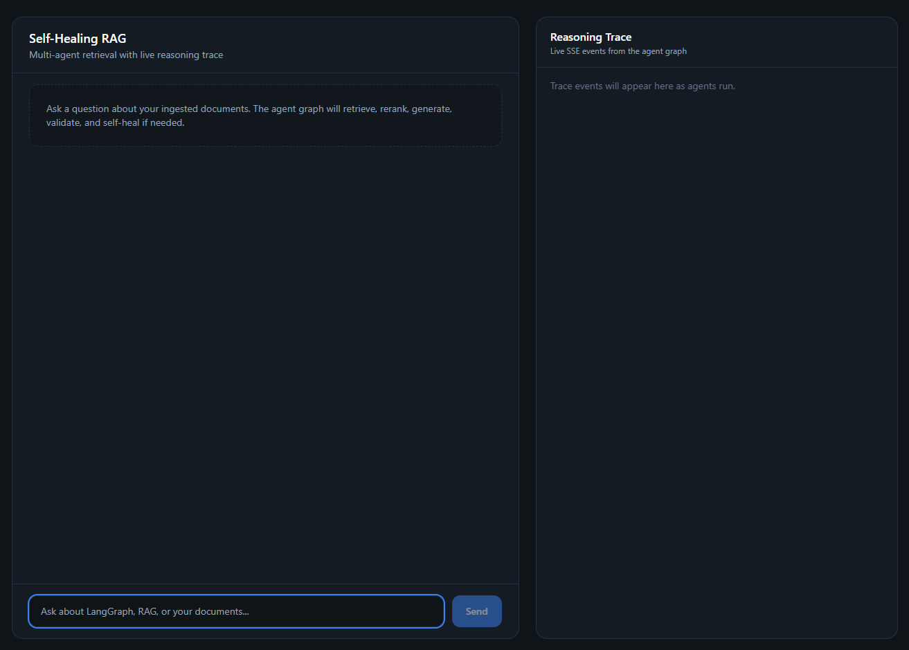
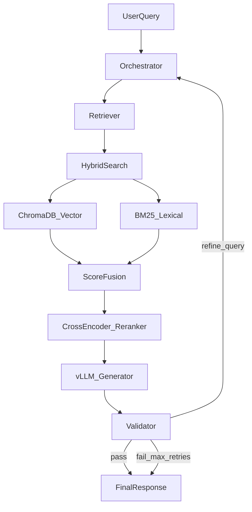

# Self-Healing Multi-Agent RAG System

A production-style multi-agent RAG pipeline that retrieves, reranks, generates, and **self-corrects** when answers fail validation. Built with LangGraph, hybrid search (ChromaDB + BM25), cross-encoder reranking, FastAPI + SSE streaming, and a Next.js UI with a live reasoning trace. Runs on local vLLM.

## Demo

### UI Overview



### Live agent trace — validation & self-healing


### Live agent trace — response generation


## About

This project implements a **self-healing RAG loop**: when the Validator agent detects an unfaithful or unsupported answer, the graph routes back through an Orchestrator that refines the query, re-retrieves context, and tries again (up to 3 retries).

**Key capabilities:**
- **Hybrid retrieval** — ChromaDB semantic search + BM25 lexical search, fused with reciprocal rank fusion (RRF)
- **Cross-encoder reranking** — `ms-marco-MiniLM-L-6-v2` re-scores top candidates for precision
- **Multi-agent LangGraph workflow** — Orchestrator → Retriever → Reranker → Generator → Validator, with conditional retry edges
- **Real-time reasoning trace** — SSE streams each agent step to the Next.js frontend
- **Local inference** — vLLM (`Qwen2.5-7B-Instruct-AWQ`) via OpenAI-compatible API
- **Evaluation** — Ragas faithfulness & context precision on a 14-question stratified eval set (see [Evaluation](#evaluation))

## Evaluation

Stratified eval on `data/eval/samples.json` (**14 Q&A pairs**, 4 corpus docs in `data/samples/`, `Qwen2.5-7B-Instruct-AWQ` via vLLM).

| Type | Count |
|---|---:|
| Direct factual | 3 |
| Multi-hop | 3 |
| Keyword / BM25-heavy | 2 |
| Ambiguous query | 2 |
| Not-answerable / insufficient context | 2 |
| Validator retry cases | 2 |

| Metric | Result |
|---|---:|
| Faithfulness | 0.73 |
| Context Precision | 0.71 |
| Avg Retrieval Latency | 0.28 sec |
| Validator Retry Rate | 28.6% |

Reproduce:

```bash
python scripts/ingest_documents.py data/samples
python scripts/run_ragas_eval.py
```

Summary metrics are committed in `data/eval/results_summary.json`; full per-record output goes to `data/eval/results.json` (gitignored).

## Architecture



## Agents

| Agent | Role |
|---|---|
| **Orchestrator** | Parses query, tracks retry count, routes flow |
| **Retriever** | Hybrid search: ChromaDB semantic + BM25 lexical |
| **Reranker** | Cross-encoder re-scores top candidates |
| **Generator** | vLLM produces answer from reranked context |
| **Validator** | Checks faithfulness; triggers query refinement on failure (max 3 retries) |

## Tech Stack

- **Orchestration:** LangGraph
- **API:** FastAPI + SSE streaming
- **Vector store:** ChromaDB
- **Lexical search:** BM25 (`rank_bm25`)
- **Reranker:** `cross-encoder/ms-marco-MiniLM-L-6-v2`
- **Embeddings:** `sentence-transformers/all-MiniLM-L6-v2`
- **LLM:** vLLM (`Qwen2.5-7B-Instruct-AWQ`)
- **Frontend:** Next.js 14 + Tailwind

## Project Structure

```
self-healing-multi-agent-rag/
├── backend/
│   ├── config.py           # Settings from .env
│   ├── graph/              # LangGraph agents & workflow
│   ├── retrieval/          # Ingestion, Chroma, BM25, hybrid, reranker
│   ├── llm/                # vLLM client
│   └── eval/               # Ragas evaluation
├── frontend/               # Next.js reasoning trace UI
├── data/                   # Documents to ingest
├── requirements.txt
├── .env.example
└── docker-compose.yml      # vLLM + backend stack
```

## Setup

```bash
# Clone and enter project
git clone https://github.com/vanshpatel20022002/self-healing-multi-agent-rag.git
cd self-healing-multi-agent-rag

# Python environment
python -m venv .venv
.venv\Scripts\activate        # Windows
pip install -r requirements.txt

# Configure
copy .env.example .env

# Ingest sample documents into ChromaDB
python scripts/ingest_documents.py data/samples

# Start API server
python scripts/run_api.py

# Frontend
cd frontend
copy .env.local.example .env.local
npm install
npm run dev
```

## API

Health check:

```bash
curl http://localhost:8080/health
```

Stream a query (SSE). Requires vLLM and ingested documents:

```bash
curl -N -X POST http://localhost:8080/query \
  -H "Content-Type: application/json" \
  -d "{\"query\": \"What is StateGraph in LangGraph?\"}"
```

`-N` disables curl buffering so `node_start`, trace, and `final_answer` events print as they arrive. Optional `thread_id` in the JSON body reuses conversation state across requests.

Run tests:

```bash
pytest
```

Evaluate retrieval quality with Ragas (requires vLLM for full run):

```bash
# Build retrieval records only
python scripts/run_ragas_eval.py --dry-run

# Full faithfulness + context precision eval
python scripts/run_ragas_eval.py
```

## Docker

Requires Docker Desktop with NVIDIA GPU support enabled.

```bash
# Full stack: vLLM + backend API
docker compose up --build

# vLLM only (run backend locally with python scripts/run_api.py)
docker compose -f docker-compose.vllm.yml up
```

On first launch, vLLM downloads the model and may take several minutes to become healthy.
The frontend still runs locally:

```bash
cd frontend
npm run dev
```

## Build Progress

| # | Feature | Status |
|---|---|---|
| 1 | Project scaffold | Done |
| 2 | Document ingestion + ChromaDB | Done |
| 3 | BM25 lexical search | Done |
| 4 | Hybrid retrieval (RRF) | Done |
| 5 | Cross-encoder reranking | Done |
| 6 | LangGraph agent nodes | Done |
| 7 | Self-healing validator loop | Done |
| 8 | FastAPI + SSE streaming | Done |
| 9 | Next.js reasoning trace UI | Done |
| 10 | Docker Compose (vLLM) | Done |
| 11 | Unit tests | Done |
| 12 | Ragas evaluation | Done |

## License

MIT
