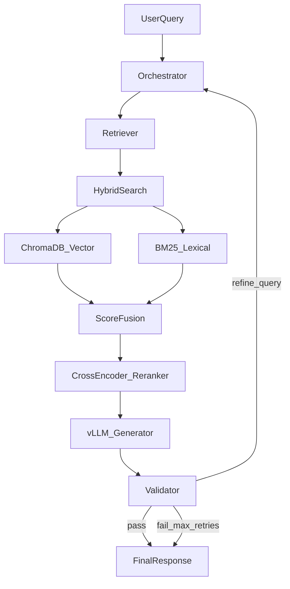

# Self-Healing Multi-Agent RAG System

Production-grade multi-agent RAG with LangGraph, hybrid search (ChromaDB + BM25), cross-encoder reranking, and a self-healing validation loop. FastAPI backend with SSE reasoning trace; Next.js frontend (coming in later commits). Powered by local vLLM.

## Architecture



## Agents

| Agent | Role |
|---|---|
| **Orchestrator** | Parses query, tracks retry count, routes flow |
| **Retriever** | Hybrid search: ChromaDB semantic + BM25 lexical |
| **Reranker** | Cross-encoder re-scores top candidates |
| **Generator** | vLLM produces answer from reranked context |
| **Validator** | Checks faithfulness; triggers query refinement on failure (max 3 retries) |

## Tech Stack

- **Orchestration:** LangGraph
- **API:** FastAPI + SSE streaming
- **Vector store:** ChromaDB
- **Lexical search:** BM25 (`rank_bm25`)
- **Reranker:** `cross-encoder/ms-marco-MiniLM-L-6-v2`
- **Embeddings:** `sentence-transformers/all-MiniLM-L6-v2`
- **LLM:** vLLM (`Qwen2.5-7B-Instruct-AWQ`)
- **Frontend:** Next.js 14 (planned)

## Project Structure

```
self-healing-multi-agent-rag/
├── backend/
│   ├── config.py           # Settings from .env
│   ├── graph/              # LangGraph agents & workflow
│   ├── retrieval/          # Ingestion, Chroma, BM25, hybrid, reranker
│   ├── llm/                # vLLM client
│   └── eval/               # Ragas evaluation
├── frontend/               # Next.js UI (later commits)
├── data/                   # Documents to ingest
├── requirements.txt
├── .env.example
└── docker-compose.yml      # vLLM stack (later commit)
```

## Setup

```bash
# Clone and enter project
git clone https://github.com/vanshpatel20022002/self-healing-multi-agent-rag.git
cd self-healing-multi-agent-rag

# Python environment
python -m venv .venv
.venv\Scripts\activate        # Windows
pip install -r requirements.txt

# Configure
copy .env.example .env

# Ingest sample documents into ChromaDB
python scripts/ingest_documents.py data/samples
```

## Build Progress

| # | Feature | Status |
|---|---|---|
| 1 | Project scaffold | Done |
| 2 | Document ingestion + ChromaDB | Done |
| 3 | BM25 lexical search | Done |
| 4 | Hybrid retrieval (RRF) | Planned |
| 5 | Cross-encoder reranking | Planned |
| 6 | LangGraph agent nodes | Planned |
| 7 | Self-healing validator loop | Planned |
| 8 | FastAPI + SSE streaming | Planned |
| 9 | Next.js reasoning trace UI | Planned |
| 10 | Docker Compose (vLLM) | Planned |
| 11 | Unit tests | Planned |
| 12 | Ragas evaluation | Planned |

## License

MIT
